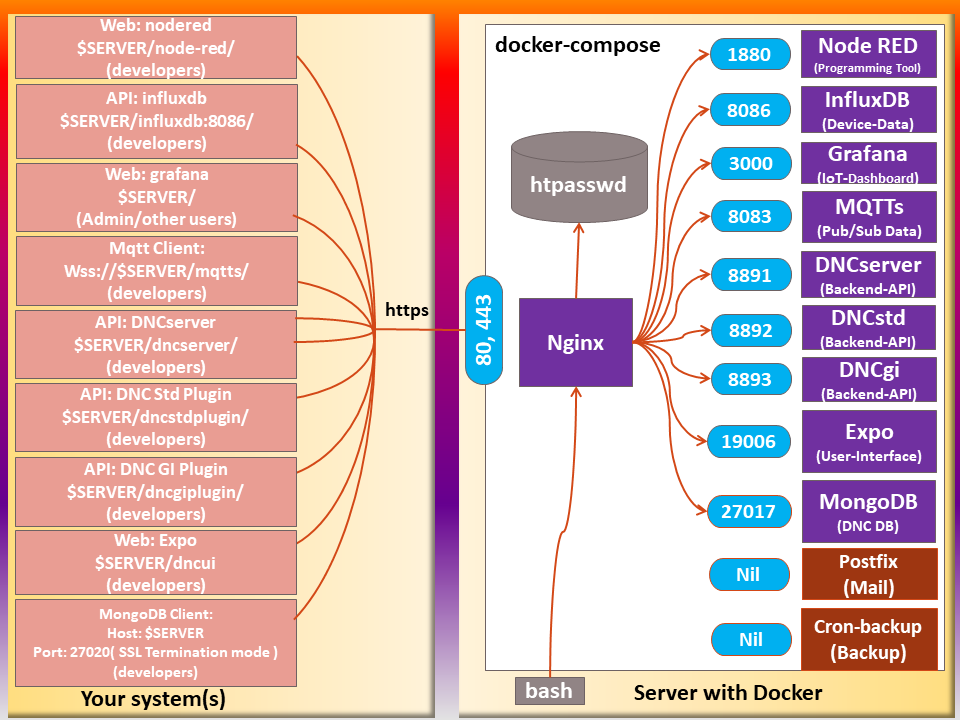

# Dashboard example for The Things Network

This repository contains a complete example that grabs device data from The Things Network, stores it in a database, and then displays the data using a web-based dashboard.

You can set this up on a "Ubuntu + Docker" VM from the Microsoft Azure store (or on a Ubuntu VM from [DreamCompute](https://www.dreamhost.com/cloud/computing/)) with minimal effort. You should set up this service to run all the time so as to capture the data from your devices; you then access the data at your convenience using a web browser.

This example uses [docker-compose](https://docs.docker.com/compose/overview/) to set up a group of four [docker containers](https://www.docker.com):

1. An instance of [Apache](http://apache.org), which proxies the other services, handles access control, gets SSL certificates from [Let's Encrypt](https://letsencrypt.org), and faces the outside world.
2. An instance of [Node-RED](http://nodered.org/), which processes the data from the individual nodes, and puts it into the database.
3. An instance of [InfluxDB](https://www.influxdata.com/), which stores the data as time-series measurements with tags.
4. An instance of [Grafana](http://grafana.org/), which gives a web-based dashboard interface to the data.

To make things more specific, most of the description here assumes use of Microsoft Azure. However, I have tested this on Ubuntu 16 LTS without difficulty (apart from the additional complexity of setting up `apt-get` to fetch docker, and the need for a manual install of `docker-compose`), and on DreamCompute. I belive that this will work on any Linux or Linux-like platform that supports docker, docker-compose, and node-red. It's likely to run on a Raspberry Pi 2, and it might even run on a C.H.I.P. computer... but as of this writing, this has not been tested.

## Definitions
* The **host system** is the system running Docker and Docker-compose.
* A **container** is one of the virtual systems running under Docker on the host system.
* A **file on the host** is a file on the host system (typically not visible from within the container(s).
* A **file in container *X*** (or a **file in the *X* container**) is a file in a filesystem associated with containser *X* (and typically not visible from the host system).

## Security
All communication with the Apache server are encrypted using SSL with auto-provisioned certificates from Let's Encrypt. Grafana is the primary point of access for most users, and Grafana's login is used for that purpose. 

Access to Node-RED and InfluxDB is via special URLs (__base__/node-red/ and __base__/influxdb/, where __base__ is the URL served by the Apache container). These URLs are protected via Apache `htpasswd` and `htgroup` file entries. These entries are files in the Apache container, and must be manually edited by an administrator.

The initial administrator's login password for grafana must be initialized prior to starting the very first; it's stored in `grafana/.env`. (When you start the grafana container the first time, it creates `grafana.db` in the grafana container, and stores the password at that time. If `grafana.db` already exists, the password in `grafana/.env` is ignored.)

Microsoft Azure, by default, will not open any of the ports to the outside world, so you will need to open port 443 for SSL access to Apache. If you want to use the influxdb API remotely, you'll also need to open port 8083.

For concreteness, the following table assumes that __base__ is `server.example.com`.

To access | Open this link | Notes
----------|----------------|--------
Node-RED | [https://server.example.com/node-red/](https://server.example.com/node-red/) | Port number is not needed and shouldn't be used.
InfluxDB administrative page | [https://server.example.com/influxdb/](https://server.example.com/influxdb/) | Port number is not needed and shouldn't be used.
InfluxDB API | [https://server.example.com/influxdb/:8083](https://server.example.com/influxdb/:8083) | Port number __is__ needed; in addition, you'll have to supply login credentials.
Grafana | [https://server.example.com](https://server.example.com) | Port number is not needed and shouldn't be used.

This can be visualized as below:


## Assumptions

* Your host system must have docker-compose 1.9 or later (for which see https://github.com/docker-compose -- be aware that apt-get normally doesn't grab this; if configured at all, it frequently gets an out-of-date version).
* The environment variable `TTN_DASHBOARD_DATA`, if set, points to the common directory for your data. If not set, docker-compose will quit at startup. (This is by design!) 
   * `${TTN_DASHBOARD_DATA}node-red` will have your local Node-RED data.
   * `${TTN_DASHBOARD_DATA}influxdb` will have your local influxdb data (this is what you should back up)
   * `${TTN_DASHBOARD_DATA}grafana` will have your dashboards

## Composition and External Ports

Within their containers, the individual programs use their usual ports, but these are isolated from the outside world, except as specified by `docker-compose.yml`.

In `docker-compose.yml`, the following ports on the docker host are connected to the individual programs.

* Apache runs on 80 and 443.  (All connections to port 80 are redirected to 443 using ssl).

Remember, if your server is running on a cloud platform like Microsoft Azure or AWS, you need to check the firewall and confirm that the ports are open to the oustide world.

## Installation

*These directions are incomplete. Please also refer to SETUP.md*

1. Make sure your server has `git`, `docker` and `docker-compose` installed, with the versions mentioned above under **Assumptions**.
2. Use `git clone` to copy this repository to your host.
3. Create a `.env` file in your repository with the following settings:
   1. `TTN_DASHBOARD_DATA=/full/path/to/directory/` 
   The trailing slash is required!
   This will put all the data file for this instance as subdirectories of the specified path. If you leave this underfined, `docker-compose` will print error messages and quit.
   2. `TTN_DASHBOARD_APACHE_FQDN=myhost.example.com` 
   This sets the name of your resulting server. It tells Apache what it's serving out.  It must be a fully-qualified domain name (FQDN) that resolves to the IP address of the container host.
   3. `TTN_DASHBOARD_CERTBOT_FQDN=myhost.example.com`
   This should be the same as `TTN_DASHBOARD_APACHE_FQDN`.
   4. `TTN_DASHBOARD_CERTBOT_EMAIL=someone@example.com`
   This sets the contact email for Let's Encyrypt. The script automatically accepts the Let's Encrypt terms of service, and this indicates who is doing the accepting.
   5. `TTN_DASHBOARD_GRAFANA_ADMIN_PASSWORD=SomethingVerySecretIndeed`
   This sets the *initial* password for the Grafana `admin` login. You should change this via the Grafana UI after booting the server.
   6. `TTN_DASHBOARD_INFLUXDB_INITIAL_DATABASE_NAME=demo`
   Change "demo" to the desired name of the initial database that will be created in InfluxDB. 
Your `.env` file should look like this:
   ```sh
    # setup for this docker-ttn-dashboard instance, used by docker-compose
    TTN_DASHBOARD_DATA=/full/path/to/directory/
    TTN_DASHBOARD_APACHE_FQDN=myhost.example.com
    TTN_DASHBOARD_CERTBOT_FQDN=myhost.example.com
    TTN_DASHBOARD_GRAFANA_ADMIN_PASSWORD=SomethingVerySecretIndeed
    TTN_DASHBOARD_INFLUXDB_INITIAL_DATABASE_NAME=demo
    ### end of file ###
   ```
5. `% docker-compose build`
   * If this fails with the message, `ERROR: Couldn't connect to Docker daemon at http+docker://localunixsocket - is it running?`, then probably your user ID is not in the `docker` group. To fix this, `sudo adduser MYUSER docker`, where "MYUSER" is your login ID. Then (**very important**) log out and log back in.
6. `% docker-compose up` or `% docker-comose up -d`
   * If this fails (for example, Node-RED dies with a "killed" status), check your `.env` file.
7. Open Grafana on **https://myhost.example.com**, and log in as admin. Change your password. Set up your first data source using InfluxDB. See below for more detailed instructions.
8. Open Node-RED on **https://myhost.example.com/node-red/**,  and build a flow that stores data in InfluxDB.  **Be sure to add the trailing slash! Otherwise you'll get a 404 from Grafana. We'll fix this soon.**

## Data Files

When designing this collection of services, we had to decide where to store the data files. We had two choices: keep them inside the docker containers, or keep them in locations on the host system. The advantage of the the former is that everything is reset when you rebuild the docker images. The disavantage of the former is that you lose all your data when you rebuild. On the other hand, there's another level of indirection when keeping things on the host, as the files reside in different locations on the host and in the docker containers.

Data files are kept in the following locations by default.

Component | Data file location on host | Location in container
----------|----------------------------|----------------------
Node-RED | `${TTN_DASHBOARD_DATA}node-red` | `/data`
InfluxDB | `${TTN_DASHBOARD_DATA}influxdb`| `/data`
Grafana | `${TTN_DASHBOARD_DATA}grafana`| `/var/lib/grafana`

As shown, you can easily change locations on the **host** (e.g. for testing). You do this by setting the environment variable `TTN_DASHBOARD_DATA` to the **absolute path** to the containing directory prior to calling `docker-compose up`. The above paths are appended to the value of `TTN_DASHBOARD_DATA`. Directories are created as needed. Consider the following example:
```bash
% export TTN_DASHBOARD_DATA=/dashboard-data/
% docker-compose up -d
```
In this case, the data files are created in the following locations:

Component | Data file location
----------|-------------------
Node-RED | `/dashboard-data/node-red`
InfluxDB | `/dashboard-data/influxdb`
Grafana | `/dashboard-data/grafana`

### Reuse and removal of data files
Since data files on the host are not removed between runs, as long as you
don't remove the files between runs, your data will preserved.

Sometimes this is inconvienient, and you'll want to remove some or all of the
data. For a variety of reasons, the data files and directories are created owned by root, so you must use the `sudo` command to remove the data files. Here's an example of how to do it:
```bash
% sudo rm -rf ${TTN_DASHBOARD_DATA}node-red
% sudo rm -rf ${TTN_DASHBOARD_DATA}influxdb
% sudo rm -rf ${TTN_DASHBOARD_DATA}grafana
```

## Node-RED and Grafana Examples

This version requires that you set up Node-RED, the database and the grafana dashboards manually, but we hope to add a reasonable set of initial files in a future release.

## Connecting to InfluxDB from Node-RED and Grafana

There is one point that is somewhat confusing about the connections from Node-RED and Grafana to InfluxDB. Even though InfluxDB is running on the same host, it is logically running on its own virtual machine (created by docker). Because of this, Node-RED and Grafana cannot use **localhost** when connecting to Grafana. A special name is provided by docker: **influxdb**.  Note that there's no DNS suffix.  If you don't use **influxdb**, Node-RED and Grafana will not be able to connect.

## Logging in to Grafana
* On the login screen, the user name is "admin". The initial password is given by the value of the variable `GF_SECURITY_ADMIN_PASSWORD` in `grafana/.env`. Note that if you change the password in `grafana/.env` after the first time you launch the grafana containder, the admin password does not change. If you somehow lose the previous value of the admin password, and you don't have another admin login, it's very hard to recover; easiest is to remove `grafana.db` and start over.

### Data source settings in Grafana
* Set the URL (under Http Settings) to `http://influxdb:8086`.
* Select the database. There's a default database called "demo", which is always created. (This is determined by the file `influxdb/.env`; if you change that file, you can rename the default database.)
* Leave user and password blank.
* Click "Save & Test".

## Future work
Although the dashboard is already very useful, it's incomplete.  Please refer to `TODO.md`, and also note that we're considering the following. Check in for updates!

1. add a script to setup the passwords initially for grafana and for access to node-red and influxdb.
2. admin script to show roles and maintain the htpasswd 
3. add the auto-update cron script -- right now you have to restart in order to get the SSL certs updated. Not a big deal, as the patches-requiring-reboot interval is shorter than the life of the certs, but still, this should be fixed.
4. Switch to [phusion](https://github.com/phusion/baseimage-docker) for the base image, instead of ubuntu.
6. providue suitable intial files for Grafana and NodeRed, assuming Catena-4450 sensor node.
7. the intial script should prompt for the data base name.

## Acknowledgements
This builds on work done by Johan Stokking of [The Things Network](www.thethingsnetwork.org) for the staging environment. Additional adaptation done by Terry Moore of [MCCI](www.mcci.com).
