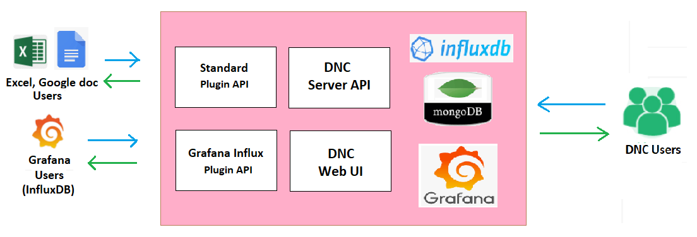
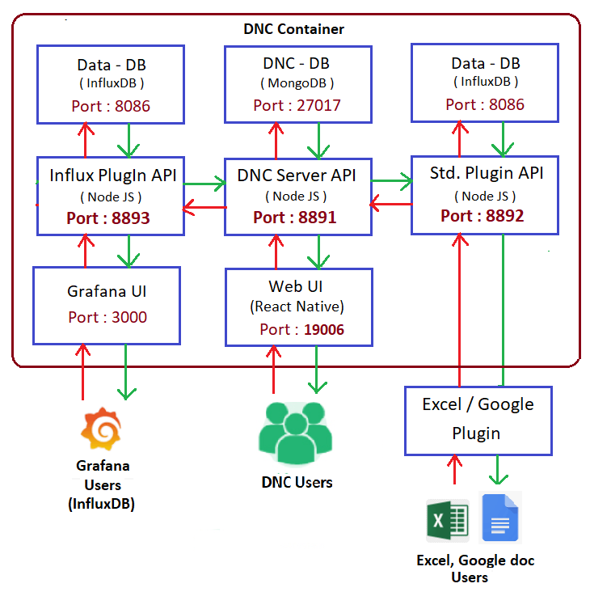

# Dashboard example for Internet of Things (IoT)

This repository contains a complete example that grabs device data from IoT-Network server, stores it in a database, and then displays the data using a web-based dashboard.

You can set this up on a Docker droplet from [Digital Ocean](https://www.digitalocean.com/) (or on an Ubuntu VM from [DreamCompute](https://www.dreamhost.com/cloud/computing/), or on an "Ubuntu + Docker" VM from the [Microsoft Azure store](https://portal.azure.com/)) with minimal effort. You should set up this service to run all the time to capture the data from your devices; you then access the data at your convenience using a web browser.

## Table of Contents

<!-- markdownlint-disable MD033 -->
<!-- markdownlint-capture -->
<!-- markdownlint-disable -->
<!-- TOC depthFrom:2 updateOnSave:true -->

- [Introduction](#introduction)
- [Definitions](#definitions)
- [Security](#security)
  - [User Access](#user-access)
  - [To access Mongodb externally](#to-access-mongodb-externally)
- [Assumptions](#assumptions)
- [Composition and External Ports](#composition-and-external-ports)
- [Data Files](#data-files)
- [Reuse and removal of data files](#reuse-and-removal-of-data-files)
- [Node-RED and Grafana Examples](#node-red-and-grafana-examples)
	- [Connecting to InfluxDB from Node-RED and Grafana](#connecting-to-influxdb-from-node-red-and-grafana)
	- [Logging in to Grafana](#logging-in-to-grafana)
	- [Data source settings in Grafana](#data-source-settings-in-grafana)
- [MQTTS Examples](#mqtts-examples)
- [Integrating Data Normalization Control(DNC) Support](#integrating-data-normalization-controldnc-support)
  - [What is DNC?](#what-is-dnc)
    - [Advantages](#advantages)
  - [Application Architecture](#application-architecture)
    - [DNC Components](#dnc-components)
    - [Plugins](#plugins)
  - [DNC server Architecture](#dnc-server-architecture)
- [Setup Instructions](#setup-instructions)
- [Influxdb Backup and Restore](#influxdb-backup-and-restore)
- [Release History](#release-history)
- [Meta](#meta)

<!-- /TOC -->
<!-- markdownlint-restore -->
<!-- Due to a bug in Markdown TOC, the table is formatted incorrectly if tab indentation is set other than 4. Due to another bug, this comment must be *after* the TOC entry. -->

## Introduction

This [`SETUP.md`](./SETUP.md) explains the Application Server Installation and its setup. [Docker](https://docs.docker.com/) and [Docker Compose](https://docs.docker.com/compose/) are used to make the installation and
setup easier.

This dashboard uses [docker-compose](https://docs.docker.com/compose/overview/) to set up a group of eight primary [docker containers](https://www.docker.com), backed by two auxiliary containers:

1. An instance of [Nginx](https://www.nginx.com/), which proxies the other services, handles access control, gets SSL certificates from [Let's Encrypt](https://letsencrypt.org/), and faces the outside world.

2. An instance of [Node-RED](http://nodered.org/), which processes the data from the individual nodes, and puts it into the database.

3. An instance of [InfluxDB](https://docs.influxdata.com/influxdb/), which stores the data as time-series measurements with tags and provides backup support for the databases.

4. An instance of [Grafana](http://grafana.org/), which gives a web-based dashboard interface to the data.

5. An instance of [Mqtt](https://mosquitto.org/), which provides a lightweight method of carrying out messaging using a publishing/subscribe model

6. An instance of [Apiserver](https://nodejs.org/en/), which runs the below APIs :

    - `DNCserver`: It is a back end component of Generic DNC, developed on NodeJS, provides RESTful APIs for Generic DNC User Interface, Grafana Influx Plugin and DNC Standard Plugin. Stores user data in MongoDB and communicates with InfluxDB to get database name and measurement name.

    - `DNCgiplugin`: It is a backend component of Generic DNC, developed on NodeJS, provides RESTful API service for interfacing Grafana UI with the Generic DNC back end. Handles the Influx query from Grafana and replace the influx Tags by the DNC Tags, Server data then communicates with the InfluxDB finally send back the response to the Grafana.

    - `DNCstdplugin`: It is a backend component of Generic DNC, developed on NodeJS, provides RESTful API service for Customized Excel Plugin UI. Receives request from Excel Plugin and communicates with DNC Server, InfluxDB and send back response to the Excel Plugin UI component.

    - `version`: It will list us version details of the **System Info** and **Docker-IoT-Dashboard Info**

7. An instance of [Mongodb](https://www.mongodb.com/), MongoDB is a document-oriented NoSQL database used for high volume data storage. Instead of using tables and rows as in the traditional relational databases, it makes use of collections and documents. Documents consist of key-value pairs which are the basic unit of data in MongoDB. Collection contains sets of documents and function which is the equivalent of relational database tables. MongoDB's data records are stored in JSON (JavaScript Object Notation) format. **DNC uses MongoDB database system to store the data**.

8. An instance of [Expo](https://docs.expo.dev/), Expo is a framework and a platform for universal React applications. **DNC User Interface designed by using React Native and native platforms. Expo runs `dncui` API which provides simple User Interface to handle all DNC components.**

The auxiliary containers are:

1. [Postfix](http://www.postfix.org/documentation.html), which (if configured) handles outbound mail services for the containers (for now, `Influxdb`, `Node-red`, `cron-backup` and `Grafana`).

2. [Cron-backup](./cron-backup), which provides backup support for the `Nginx`, `Node-red`, `Grafana`, `Mongodb` and `Mqtts` containers and pushed the backed up data to S3-compatible storage.

To make things more specific, most of the description here assumes use of Digital Ocean. However, this was tested on Ubuntu 20.04 with no issues (apart from the additional complexity of setting up `apt-get` to fetch docker, and the need for a manual installation of `docker-compose`), on Dream Compute, and on Microsoft Azure. This will work on any Linux or Linux-like platform that supports `docker` and `docker-compose`. **Note:** Its likelihood of working with Raspberry Pi has not been tested as yet.

## Definitions

- The **host system** is the system that runs Docker and Docker-compose.

- A **container** is one of the virtual systems running under Docker on the host system.

- A **file on the host** is a file present on the host system (typically not
    visible from within the container(s)).

- A **file in container X** (or a **file in the X container**) is a file
    present in a file-system associated with container *X* (and typically not
    visible from the host system).

## Security

All communication with the Nginx server is encrypted using SSL with auto-provisioned certificates from Let's Encrypt. Grafana is the primary point of access for most users, and Grafana's login is used for that purpose. Access to Node-RED and InfluxDB is via special URLs (**base**/node-red/ and **base**/influxdb:8086/, where **base** is the URL served by the Nginx container). These URLs are protected via Nginx `htpasswd` file entries. These entries are files in the Nginx container, and must be manually edited by an Administrator.

The initial administrator's login password for Grafana must be initialized prior to starting; it's stored in `.env`. (When the Grafana container is started for the first time, it creates `grafana.db` in the Grafana container, and stores
the password at that time. If `grafana.db` already exists, the password in grafana/.env is ignored.)

*Note:-* Microsoft Azure, by default, will not open any of the ports to the outside world, so the user will need to open port 443 for SSL access to Nginx.

For concreteness, the following table assumes that **base** is “dashboard.example.com”.

### User Access

|**To access**| **Open this link**| **Notes**|
|-------------|-------------------|----------|
| Node-RED    | <https://dashboard.example.com/node-red/> | Port number is not needed and shouldn't be used. Note trailing '/' after node-red.                        |
| InfluxDB API queries | <https://dashboard.example.com/influxdb:8086/> | Port number is needed. Also note trailing '/' after influxdb.                                             |
| Grafana    | <https://dashboard.example.com/> | Port number is not needed and shouldn't be used.                                                          |
| Mqtts       | <wss://dashboard.example.com/mqtts/>| Mqtt client is needed. To test it via [Mqtt web portal](http://tools.emqx.io/) |
| Apiserver  | DNC Server: <https://dashboard.example.com/dncserver> | This API calls starts with the URL.
|| DNC Standard Plugin: <https://dashboard.example.com/dncstdplugin> | This API calls starts with the URL|
|| DNC Grafana-Influx Plugin: <https://dashboard.example.com/dncgiplugin> | This API calls starts with the URL|
|| Version info: <https://dashboard.example.com/version> | Can view the version details on any web browser using the link. |
|Expo| <https://dashboard.example.com/dncui> | Port number is not needed and shouldn't be used.|

### To access MongoDB externally

**(via [Nginx SSL Termination mode](https://docs.nginx.com/nginx/admin-guide/security-controls/terminating-ssl-tcp/))**

- server: `dashboard.example.com`
- port: `27020`
- username: `IOT_DASHBOARD_MONGO_INITDB_ROOT_USERNAME`
- password: `IOT_DASHBOARD_MONGO_INITDB_ROOT_PASSWORD`
- Authentication DB: `admin`
- Connect to database: `admin`
- SSL support: `yes`

This can be visualized as shown in the figure below:

### Docker connection and User Access


## Assumptions

- The host system must have docker-compose version 1.9 or later (for which <https://github.com/docker-compose> -- be aware that apt-get normally doesn't grab this; if configured at all, it frequently gets an out-of-date version).

- The environment variable `IOT_DASHBOARD_DATA`, if set, points to the common directory for the data. If not set, docker-compose will quit at start-up. (This is by design!)

  - `${IOT_DASHBOARD_DATA}node-red` will have the local Node-RED data.

  - `${IOT_DASHBOARD_DATA}influxdb` will have the local InfluxDB data (this should be backed-up)

  - `${IOT_DASHBOARD_DATA}grafana` will have all the dashboards

  - `${IOT_DASHBOARD_DATA}docker-nginx` will have `.htpasswd` credentials folder `authdata` and Let's Encrypt certs folder `letsencrypt`

  - `${IOT_DASHBOARD_DATA}mqtt/credentials` will have the user credentials

  - `${IOT_DASHBOARD_DATA}apiserver/dncserver:/apiserver/dncserver` will have the source data required to run `dncserver` API.

  - `${IOT_DASHBOARD_DATA}apiserver/dncstdplugin:/apiserver/dncstdplugin` will have the source data required to run `dncstdplugin` API.

  - `${IOT_DASHBOARD_DATA}apiserver/dncgiplugin:/apiserver/dncgiplugin` will have the source data required to run `dncgiplugin` API.

  - `${IOT_DASHBOARD_DATA}mongodb/mongodb_data` will have local MongoDB data (this should be backed-up).

  - `${IOT_DASHBOARD_DATA}expo/dncui:/expo/dncui` will have the source data required to run `dncui` API.

## Composition and External Ports

Within the containers, the individual programs use their usual ports, but these are isolated from the outside world, except as specified by `docker-compose.yml` file.

In `docker-compose.yml`, the following ports on the docker host are connected to the individual programs.

- Nginx runs on 80/tcp and 443/tcp. (All connections to port 80 are redirected to 443 using SSL).

- MQTTS(Mosquitto) runs on
  - 443/tcp for MQTT over Nginx proxy
  - 8883/tcp for MQTT over TLS/SSL
  - 8083/tcp for WebSockets over TLS/SSL
  - 1883/tcp for MQTT over TCP protocol (not secure);(Disabled by default)

*The below ports are exposed only for the inter-container communication; These ports can't be accessed by host system externally.*

- Grafana runs on 3000/tcp.

- Influxdb runs on 8086/tcp.

- Node-red runs on 1880/tcp.

- Postfix runs on 25/tcp.
- Apiserver runs on the below ports

  - DNC-server runs on 8891/tcp.

  - DNC-Std-Plugin runs on 8892/tcp.

  - DNC-GI-Plugin runs on 8893/tcp.

- Expo runs on 19006/tcp.

- Mongodb runs on 27017/tcp.

Remember, if the server is running on a cloud platform like Microsoft Azure or AWS, one needs to check the firewall and confirm that the ports are open to the outside world.

## Data Files

When designing this collection of services, there were two choices to store the
data files:

- We could keep them inside the docker containers, or

- We could keep them in locations on the host system.

The advantage of the former is that everything is reset when the docker images are rebuilt. The disadvantage of the former is that there is a possibility to lose all the data when it’s rebuilt. On the other hand, there's another level of indirection when keeping things on the host, as the files reside in different locations on the host and in the docker containers.

Because IoT data is generally persistent, we decided that the extra level of indirection was required. To help find things, consult the following table. Data files are kept in the following locations by default.

| **Component** | **Data file location on host**                | **Location in container**     |
|---------------|-----------------------------------------------|-------------------------------|
| Node-RED      | `${IOT_DASHBOARD_DATA}node-red`               | /data                         |
| InfluxDB      |  `${IOT_DASHBOARD_DATA}influxdb`              | /var/lib/influxdb             |
| Grafana       | `${IOT_DASHBOARD_DATA}grafana`                | /var/lib/grafana              |
| Mqtt          | `${IOT_DASHBOARD_DATA}mqtt/credentials`       | /etc/mosquitto/credentials    |
| Nginx         | `${IOT_DASHBOARD_DATA}docker-nginx/authdata`  | /etc/nginx/authdata           |
| Let's Encrypt certificates |`${IOT_DASHBOARD_DATA}docker-nginx/letsencrypt`| /etc/letsencrypt |
| DNCserver     | `${IOT_DASHBOARD_DATA}apiserver/dncserver`    | /apiserver/dncserver          |
| DNCgiplugin   | `${IOT_DASHBOARD_DATA}apiserver/dncgiplugin`  | /apiserver/dncgiplugin        |
| DNCstdplugin  | `${IOT_DASHBOARD_DATA}apiserver/dncstdplugin` | /apiserver/dncstdplugin       |
| Mongodb       | `${IOT_DASHBOARD_DATA}mongodb/mongodb_data`   | /data/db                      |
| Expo          | `${IOT_DASHBOARD_DATA}expo/dncui`             |  /expo/dncui                  |

As shown, one can easily change locations on the **host** (e.g. for testing). This can be done by setting the environment variable `IOT_DASHBOARD_DATA` to the **absolute path** (with trailing slash) to the containing directory prior to
calling `docker-compose up`. The above paths are appended to the value of `IOT_DASHBOARD_DATA`. Directories are created as needed.

Normally, this is done by an appropriate setting in the `.env` file.

Consider the following example:

```console
$ grep IOT_DASHBOARD_DATA .env
IOT_DASHBOARD_DATA=/dashboard-data/
$ docker-compose up –d
```

In this case, the data files are created in the following locations:

Table Data Location Examples

| **Component** | **Data file location**            |
|---------------|-----------------------------------|
| Node-RED      | /dashboard-data/node-red          |
| InfluxDB      | /dashboard-data/influxdb          |
| Grafana       | /dashboard-data/grafana           |
| Mqtt          | /dashboard-data/ mqtt/credentials |
| Nginx         | /dashboard-data/docker-nginx/authdata|
| Let's Encrypt certificates  | /dashboard-data/docker-nginx/letsencrypt |
| DNCserver     | /dashboard-data/apiserver/dncserver     |
| DNCgiplugin   | /dashboard-data/apiserver/dncgiplugin`  |
| DNCstdplugin  | /dashboard-data/apiserver/dncstdplugin` |
| Mongodb       | /dashboard-data/mongodb/mongodb_data`   |
| Expo          | /dashboard-data/expo/dncui              |

## Reuse and removal of data files

Since data files on the host are not removed between runs, as long as the files are not removed between runs, the data will be preserved.

Sometimes this is inconvenient, and it is necessary to remove some or all of the data. For a variety of reasons, the data files and directories are created owned by root, so the `sudo` command must be used to remove the data files. Here's an example of how to do it:

```bash
source .env
sudo rm -rf ${IOT_DASHBOARD_DATA}node-red
sudo rm -rf ${IOT_DASHBOARD_DATA}influxdb
sudo rm -rf ${IOT_DASHBOARD_DATA}Grafana
sudo rm –rf ${IOT_DASHBOARD_DATA}mqtt
sudo rm -rf ${IOT_DASHBOARD_DATA}docker-nginx
sudo rm -rf ${IOT_DASHBOARD_DATA}apiserver
sudo rm -rf ${IOT_DASHBOARD_DATA}mongodb
sudo rm -rf ${IOT_DASHBOARD_DATA}expo
```

## Node-RED and Grafana Examples

This version requires that you set up Node-RED, the Influxdb database and the Grafana dashboards manually, but we hope to add a reasonable set of initial files in a future release.

### Connecting to InfluxDB from Node-RED and Grafana

There is one point that is somewhat confusing about the connections from Node-RED and Grafana to InfluxDB. Even though InfluxDB is running on the same host, it is logically running on its own virtual machine (created by docker). Because of this, Node-RED and Grafana cannot use **`local host`** when connecting to InfluxDB. A special name is provided by docker: `influxdb`. Note that there's no DNS suffix. If `influxdb` is not used, Node-RED and Grafana will not be able to connect.

### Logging in to Grafana

On the login screen, the initial username is "`admin`". The initial password is given by the value of the variable `IOT_DASHBOARD_GRAFANA_ADMIN_PASSWORD` in `.env`. Note that if you change the password in `.env` after the first time you launch the grafana container, the admin password does not change. If you somehow lose the previous value of the admin password, and you don't have another admin login, it's very hard to recover; easiest is to remove `grafana.db` and start over.

### Data source settings in Grafana

- Set the URL (under HTTP Settings) to <http://influxdb:8086>.

- Select the database.

- Leave the username and password blank.

- Click "Save & Test".

## MQTTS Examples

Mqtts can be accessed in the following ways:

Method  |  Hostname/Path | Port | Credentials
--------|----------------|------|------------
MQTT over Nginx proxy | <wss://dashboard.example.com/mqtts/> | 443 | Username/Password come from mosquitto’s configuration (password_file)
MQTT over TLS/SSL | dashboard.example.com | 8883 | Username/Password come from mosquitto’s configuration (password_file)
WebSockets over TLS/SSL | <wss://dashboard.example.com/> | 8083 | Username/Password come from mosquitto’s configuration (password_file)
MQTT over TCP protocol (not secure) | dashboard.example.com | 1883 |Username/Password come from mosquitto’s configuration (password_file)

## Integrating Data Normalization Control(DNC) Support

### What is DNC?

DNC is a logical data server, designed to achieve location based data measurement by provide customized tag mapping on top of a general database where sensor data is organized based on device IDs (Hardware device ID).


The visibility of clients Data Server is controlled by the DNC Server, users can make data query based on the tags provided in the DNC device mapping, DNC Server removes the customized DNC tags and add required tags available in the mapping field, send converted query to client’s Data Server, receives the response, then remove the tags, add the respective DNC tags and send the response to the user.

#### Advantages

- Location-based data measurement
- Device is considered as a logical unique object, loosely coupled with hardware
- Device changing of a location can easily be mapped.
- No data loss due to device change/replacement
- User can provide convenient naming for their device

### Application Architecture



#### DNC Components

##### Client

In DNC, Client is like a profile, each client can be created with a set of tags, and it requires Database credentials to query data from Data Server.

| Field | Description |
|-------|-------------|
| Name | Name of the Client |
| TagsList | List of Tags (Customized tags)
|| Example-1:
|| Tag1 – Country, Tag2 – State, Tag3 – City, Tag4 – Street, Tag5 – Device Name
|| Example-2:
|| Tag1- Site, Tag2 – Pile, Tag3 – Location, Tag4 - DeviceName
| DBData | DataBase Server Credentials. (Most cases: InfluxDB)
|| 1. DB URL, 2. UserName, 3. Password, 4. Database Name |

A Client can be created only by the Master Admin, once a client profile is created, Admin and User account can be created for that Client. The Client admin can add new devices under the Client profile.

##### Device Registry

This is the gateway for adding devices to the DNC Server. This record contains all devices entries irrespective of Clients.

| Fields | Description |
|--------|-------------|
| Client | Name Device will be assigned to this Client |
|Hardware ID | ID of the Hardware printed in the PCB |
| deviceID | ID received from TTN/Sigfox – This data should be existed as a tag in the influxDB database |
| devID | ID received from TTN/Sigfox– This data should be existed as a tag in the influxDB database |
| devEUI | ID received from TTN/Sigfox– This data should be existed as a tag in the influxDB database |
| Measurement Name | Where the device data gets logged in the Database Server. (In InfluxDB it is called as measurement name)|
| Field Data Name | Name of the Data which required by the Client.  Example [ tWater/rh/vBat etc.] This data should be existed as a field tag in the influxDB database |
| Date of Installation | The date when the device installed in the field |
| Data of Removal | The date when device removed from the field. This will not be asked while adding device, required only remove/replace device |

The Master Admin has the access to manage this record, no other can do any changes in this record.
**Note:-** The deviceID, devID and devEUI are optional but any-one should be mandatory.

##### Devices

This is the gateway for adding devices under a client with the customized tag details. All tag details are optional, the admin can add device with or without tag fields.

| Fields | Description |
|------- | ----------- |
| Hardware ID | Select from the Master Record, direct entry not allowed |
| Tag 1 - optional | Value for the Tag |
| Tag 2 - optional | Value for the Tag N - optional Value for the Tag |
| Latitude | Location coordinates – Required when showing data on world map |
| Longitude | Location coordinates – Required when showing data on world map |
| Installation Date | Get it from the Master record |
| Removal Date | Enter the date when the device removed from the field. This date automatically updated to Master record. |

#### Plugins

Plugins are created to provide User interface for using DNC application, which communicates with DNC engine by using the Plugin API.

##### Standard Plugin API

This API receives the request from Excel sheet or Google sheet Plugin, communicates with the DNC server, InfluxDB and sends back the response to the Plugin.

##### Grafana Influx Plugin API

This API receives requests from Grafana application, which are influxDB based queries. In Grafana UI all the requests are redirected to Grafana Influx Plugin, which communicates with DNC server, InfluxDB and then sends the response back to Grafana UI.

### DNC server Architecture



## Setup Instructions

Please refer to [`SETUP.md`](./SETUP.md) for detailed basic set-up instructions.

Please create a `New discussion` [`on this repository`](https://github.com/mcci-catena/docker-iot-dashboard/discussions) for getting support on DNC.

## Influxdb Backup and Restore

Please refer to [`influxdb/README.md`](./influxdb/README.md).

## Release History

- HEAD has the following changes.

  - Included `Apiserver` and `Expo` Containers for DNC support.
  - Documented the process behind the `DNC` support.
  - Provided backup support for `Mongodb` container's data

- [v2.0.0](https://github.com/mcci-catena/docker-iot-dashboard/releases/tag/v2.0.0) includes the following changes

  - Included auxiliary backup container (`cron-backup`) for providing backup support for `Nginx`, `Node-red`, `Grafana`,and `Mqtts` containers.
  - Updated the base images used in all `Dockerfile` from bionic to focal.
  - Added Mosquitto (MQTT client) Ubuntu PPA repository to install the latest version and fixed ownership issue when accessing Let's Encrypt certs.
  - Added TLS/SSL based SMTP authentication support in `Postfix` container.
  - Some minor changes in the following files: Dockerfile, docker-compose.yml, setup.md and shell scripts.

- [v1.0.0](https://github.com/mcci-catena/docker-iot-dashboard/releases/tag/v1.0.0) has the following changes

  - Influxdb:
    1. Backup script is updated for backing up online (live) databases and to push the backup to Amazon bucket.
    2. Crontab was set for automatic backup.
    3. Supports sending email for backup alerting.
  - Nginx:
    1. The Apache setup is migrated to Nginx.
    2. Proxy-ing the services like (influxdb, grafana, node-red, mqtts over proxy) was updated.
  - Node-red:
    1. supports data flowing via MQTT channel and HTTPS Endpoint
    2. supports sending email.

  - MQTTS:
    1. supports different connections as below:
        1. Mqtt Over Nginx proxy.
        2. Mqtt over TCP (disabled by default)
        3. Mqtt over TLS/SSL
        4. Mqtt over Websockets (WSS)

  - Postfix:
    1. Configured to Relay mails via External SMTP Auth (Tested with Gmail and Mailgun).
    2. Mails generated from Containers like Grafana, Influxdb and Node-red will be relayed through Postfix container.

## Meta
